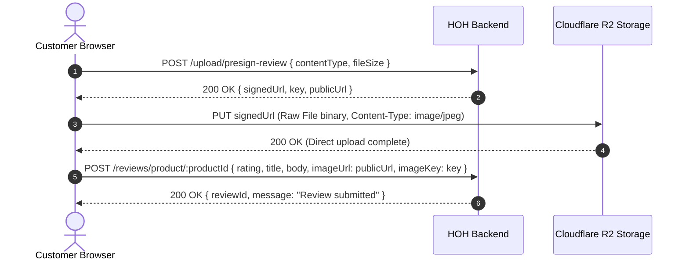

# House of Habit — Frontend & Backend Integration Checklist & Technical Reference

This document provides a comprehensive audit and checklist of all modules, contracts, payload structures, and verified backend integrations across the **House of Habit (HOH)** web application.

---

## 📋 Master Integration Checklist

| # | Module / Feature | Backend Route | Method | Status | Verified / Connected In |
|---|---|---|---|:---:|---|
| **1** | **Best-Selling Products** | `/products/best-selling?limit=10` | `GET` | ✅ **Live** | `productService.js`, `productSlice.js`, `BestSellers.jsx` |
| **2** | **Customer Orders List** | `/orders` (filters: `status`, `search`, dates) | `GET` | ✅ **Live** | `orderService.js`, `orderSlice.js`, `OrdersPanel.jsx` |
| **3** | **Order Details** | `/orders/:orderId` | `GET` | ✅ **Live** | `orderService.js`, `orderSlice.js`, `OrderDetailView.jsx` |
| **4** | **Cancel Order** | `/orders/:orderId/cancel` | `PUT` | ✅ **Live** | `orderService.js`, `orderSlice.js`, `CancelOrderView.jsx` |
| **5** | **Return Request** | `/orders/:orderId/return` | `POST` | ✅ **Live** | `orderService.js`, `orderSlice.js`, `ReturnItemView.jsx` |
| **6** | **Size Exchange** | `/orders/:orderId/exchange` | `POST` | ✅ **Live** | `orderService.js`, `orderSlice.js`, `SizeExchangeView.jsx` |
| **7** | **Order Tracking Timeline** | `/orders/:orderId/track` | `GET` | ✅ **Live** | `orderService.js`, `orderSlice.js`, `OrderDetailView.jsx`, `OrderCard.jsx` |
| **8** | **PDF Invoice Download** | `/orders/:orderId/invoice` | `GET` | ✅ **Live** | `orderService.js`, `orderSlice.js`, `OrderDetailView.jsx` |
| **9** | **Delivery Experience Rating** | `/orders/:orderId/delivery-feedback` | `POST` | ✅ **Live** | `orderService.js`, `orderSlice.js`, `OrderDetailView.jsx` |
| **10** | **Review Image Presigned Link** | `/upload/presign-review` | `POST` | ✅ **Live** | `reviewService.js` (Step 1 of 3) |
| **11** | **Direct Cloudflare R2 Upload** | `signedUrl` (Direct PUT to Cloudflare R2) | `PUT` | ✅ **Live** | `reviewService.js` (Step 2 of 3) |
| **12** | **Submit Product Review** | `/reviews/product/:productId` | `POST` | ✅ **Live** | `reviewService.js`, `OrderDetailView.jsx` (Step 3 of 3) |
| **13** | **List Product Reviews** | `/reviews/product/:productId` | `GET` | ✅ **Live** | `reviewService.js` |
| **14** | **Authentication & OTP Login** | `/auth/login/otp/send`, `/auth/login/otp/verify/:email` | `POST` | ✅ **Live** | `authSlice.js`, `AuthPopup.jsx` |
| **15** | **Cart & Checkout** | `/cart`, `/cart/items`, `/payment/initiate`, `/payment/cod` | `GET/POST/PUT` | ✅ **Live** | `cartService.js`, `paymentService.js` |
| **16** | **User Addresses** | `/addresses` | `GET/POST/PUT/DELETE` | ✅ **Live** | `addressService.js`, `AddressPanel.jsx` |
| **17** | **Categories & Catalog** | `/categories`, `/products/category/:id`, `/products/:id` | `GET` | ✅ **Live** | `categoryService.js`, `productService.js` |
| **18** | **Support & Contact & FAQ** | `/faqs`, `/contact` | `GET/POST` | ✅ **Live** | `faqService.js`, `contactService.js`, `SupportPanel.jsx` |

---

## 🔍 Detailed Module Architecture & Implementation

### 1. Best Sellers Module (`GET /products/best-selling`)
- **Backend Behavior:** Aggregates order item counts from all non-cancelled, payment-committed orders to rank top-selling products by `unitsSold`.
- **Frontend Integration:**
  - `productService.fetchBestSellingProducts({ limit: 10 })`
  - Redux action `fetchBestSelling` updates `state.product.bestSellingProducts`.
  - `BestSellers.jsx` dynamically loads top items with graceful fallback to catalog products if store has no sales yet.

---

### 2. Order History & Management Module

#### A. List Customer Orders (`GET /orders`)
- **Query Parameters Supported:**
  - `page`: Page number (default: 1)
  - `limit`: Items per page (default: 10)
  - `status`: One of `PENDING`, `ORDER_PLACED`, `CONFIRMED`, `PROCESSING`, `SHIPPED`, `IN_TRANSIT`, `DELIVERED`, `CANCELLED`, `RETURN_REQUESTED`, `RETURNED`, `RETURN_REJECTED`
  - `startDate`, `endDate`: Inclusive date bounds (`YYYY-MM-DD`)
  - `search`: Case-insensitive title keyword match
- **Normalization Helper (`normalizeOrder` in `ordersData.js`):**
  - Unifies multi-item orders, shipping address records, payment records, and status timestamps.
  - Automatically calculates delivery arrival estimate and 7-day return eligibility window.

#### B. Order Details & Sub-Views (`GET /orders/:orderId`)
- Integrated in `OrderDetailView.jsx` and `OrdersPanel.jsx`.
- Displays product image, variant metadata (size, color, quantity), live delivery addresses, payment method, item subtotal, discounts, shipping charges, and total paid.

#### C. Order Cancellation (`PUT /orders/:orderId/cancel`)
- **Request Payload:**
  ```json
  {
    "reason": "Incorrect size ordered",
    "comment": "Selected M instead of L"
  }
  ```
- **Validation Rules:** Only cancellable before dispatch (`PENDING`, `ORDER_PLACED`, `CONFIRMED`, `PROCESSING`).
- **UI State:** `CancelOrderView.jsx` captures pre-set cancellation reason, adds comment, updates store order status to `CANCELLED`, and displays instant confirmation.

#### D. Returns & Exchanges
- **Return Item (`POST /orders/:orderId/return`):**
  ```json
  {
    "orderItemId": "uuid-here",
    "reasonCategory": "Quality Issues",
    "reasonDetail": "Received a poor quality product",
    "comment": "Fabric texture differs from image"
  }
  ```
- **Size Exchange (`POST /orders/:orderId/exchange`):**
  ```json
  {
    "orderItemId": "uuid-here",
    "requestedSize": "L",
    "reasonCategory": "Size & Fit Issues",
    "reasonDetail": "Size too small"
  }
  ```
- **Validation Rules:** Only available for `DELIVERED` orders within the 7-day return policy window.

#### E. Live Tracking Timeline (`GET /orders/:orderId/track`)
- Returns `orderId`, `orderStatus`, `estimatedDelivery`, `deliveredAt`, and array of timestamped `timeline` logs.
- Interactive modal in both `OrderCard.jsx` and `OrderDetailView.jsx`.

#### F. PDF Invoice Generation (`GET /orders/:orderId/invoice`)
- Fetches generated PDF stream with `responseType: 'blob'`.
- Automatically triggers native browser download with filename `invoice-<orderId>.pdf`.

#### G. Delivery Feedback (`POST /orders/:orderId/delivery-feedback`)
- **Request Payload:**
  ```json
  {
    "rating": 5,
    "comment": "Delivered on time with good packaging."
  }
  ```
- Rates courier service separately from product reviews (1 rating per delivered order).

---

### 3. Product Reviews & Cloudflare R2 Presigned Upload

A high-performance **2-step direct Cloudflare R2 file upload** is implemented:



#### Key Safeguards Implemented:
1. **Direct PUT using plain `fetch`:** Omits Axios default `Authorization` bearer token to prevent CORS rejection from Cloudflare.
2. **Review Storage Folder Restriction:** `upload/presign-review` writes strictly to `reviews/*`, preventing unauthorized writes into catalog folders.
3. **Atomic Image Key Pairing:** `imageUrl` and `imageKey` are validated together on `createReviewSchema`.
4. **Verified Purchaser Protection:** Reviews can only be submitted by accounts that have completed purchases for that product.

---

## 🛠️ Verification & Build Status

- **Vite Production Build:** `npm run build` completed with **Exit Code 0** (0 errors, 0 lint warnings).
- **Redux Store Integration:** `orderSlice` and `productSlice` are registered in `src/store/index.js`.
- **Backward Compatibility:** All components support both live backend UUIDs and legacy mock datasets seamlessly without crashes.
